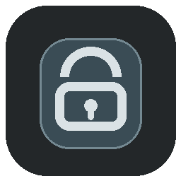
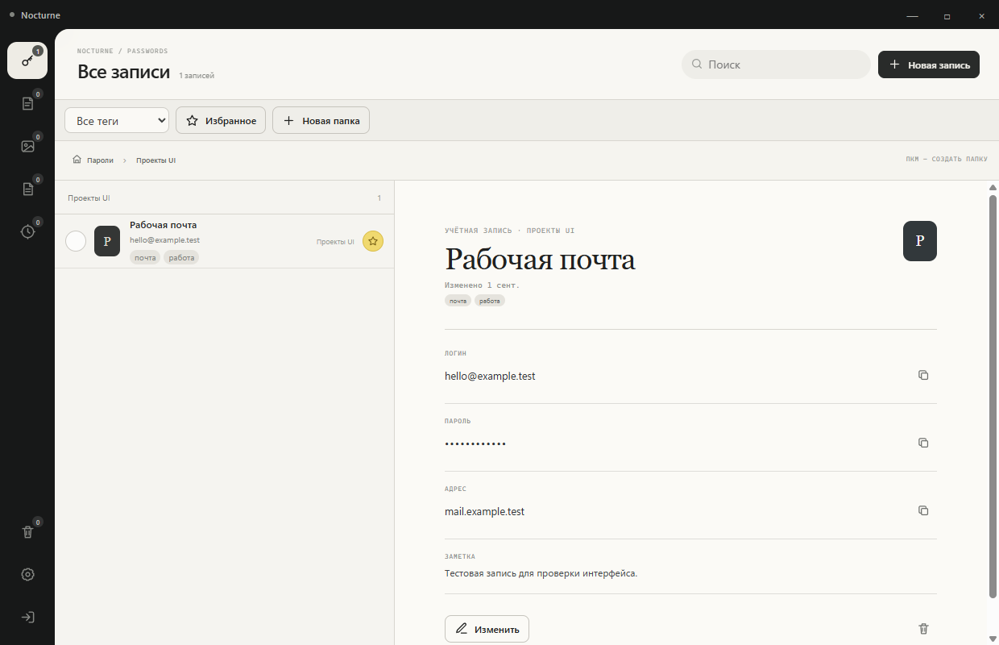
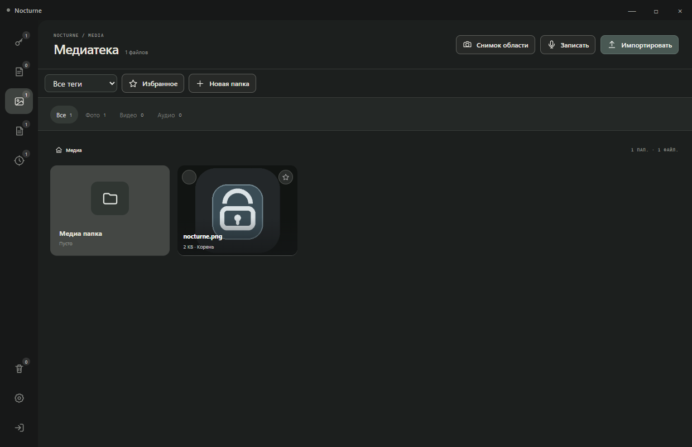
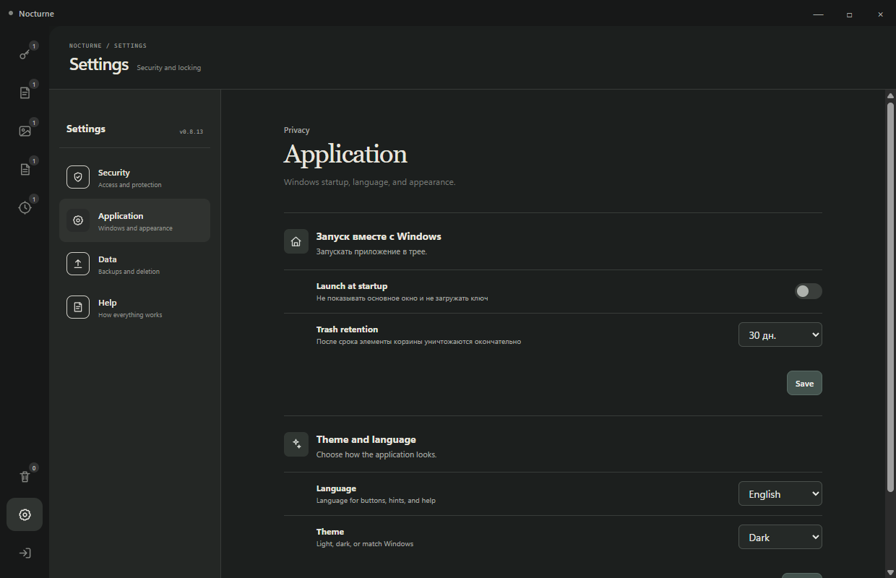
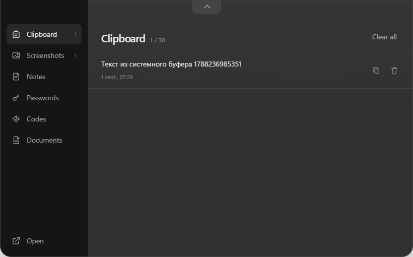

<div align="center">
  
  <h1>Nocturne Vault</h1>
  <p><strong>A private encrypted space for Windows</strong></p>
  <p>Passwords, access codes, notes, and files stay on your computer — no account or cloud server required.</p>
  <p>
    <a href="README.md">Русский</a>
    ·
    <strong>English</strong>
  </p>
  <p>
    <a href="https://github.com/Yablloko/nocturne-vault/actions/workflows/ci.yml"></a>
    
    
    
    <a href="LICENSE"></a>
  </p>
</div>



## What it is

Nocturne Vault combines the familiarity of a file manager with an encrypted private vault. Folders open on double-click, items select on a single click and move by drag and drop, while `Enter` and `Escape` behave just as you expect on Windows.

| Area | What it stores |
| --- | --- |
| **Passwords** | Accounts, password generator, tags, favorites, and safe copying |
| **Access codes** | Local TOTP codes with QR and `otpauth://` import |
| **Notes** | Text, attached images, folders, and quick search |
| **Media** | Photos, videos, and audio with built-in viewing |
| **Documents** | TXT, Markdown, PDF, Office, OpenDocument, and text version history |
| **Quick access** | A protected panel for clipboard history, screenshots, notes, passwords, and codes |

## Highlights

- **No account.** The app is ready as soon as you create a local vault.
- **No required internet connection.** Core features work entirely offline.
- **One organization model.** Nested folders, tags, favorites, drag and drop, and multi-select work across every area.
- **Light and dark themes.** The interface is available in English and Russian.
- **Windows integration.** File Explorer context menu, system tray, hidden startup, and region capture.
- **Serverless recovery.** Move an encrypted backup and open it with the master password.

## Interface

| Dark media library | English settings |
| :---: | :---: |
|  |  |

<details>
  <summary><strong>Show the quick-access panel</strong></summary>
  <br>
  
</details>

## How data is protected

- the main container and stored files use AES-256-GCM encryption;
- the master key is derived with `scrypt` and a unique salt;
- the master password is neither stored nor sent to the developer;
- the vault locks on inactivity, sleep, and Windows lock;
- window protection can prevent capture and conceal content when focus is lost;
- media and documents are viewed without plaintext temporary copies;
- trash remains encrypted until an item is restored or permanently removed.

> [!IMPORTANT]
> Keep the master password and a backup in separate safe places. Without the master password, quick unlock method, or recovery key, encrypted data cannot be recovered.

See the [security policy](SECURITY.en.md) for details.

## Installation

Ready-to-use Windows builds are published under [Releases](https://github.com/Yablloko/nocturne-vault/releases). To update, run the newer installer over the existing installation; user vault data is preserved.

### Build from source

Windows and Node.js 22 or newer are required.

```powershell
corepack enable
pnpm install --frozen-lockfile
pnpm start
```

Build the NSIS installer:

```powershell
pnpm dist:win
```

The result is written to `dist/Nocturne-Vault-Setup-0.8.13.exe`.

## Project checks

```powershell
pnpm check
pnpm test
node tests/ui-smoke.js
node tests/quick-ui-smoke.js
node tests/quick-restart-ui-smoke.js
```

GitHub Actions runs static checks and functional tests for every push and Pull Request. UI smoke tests additionally validate the packaged Windows application locally.

## Project layout

```text
src/
├── main.js             Main window, system tray, and Windows integration
├── renderer/           Main application interface
├── quick/              Quick-access panel
└── services/           Encryption, storage, documents, TOTP, and preferences
tests/                  Functional and interface checks
build/                  Windows installer configuration
assets/                 Application icon
```

## Contributing

Read [CONTRIBUTING.en.md](CONTRIBUTING.en.md) before making a change. Report security problems privately by following [SECURITY.en.md](SECURITY.en.md).

## Status and license

The project is under active development. Its cryptography has not yet received an independent external audit.

The source code is distributed under the [GNU General Public License v3.0](LICENSE). Modified versions that are distributed must remain open under GPL-3.0. Copyright © 2026 Nocturne.

<div align="center">
  <sub>Built for people who want to keep personal data personal.</sub>
</div>
